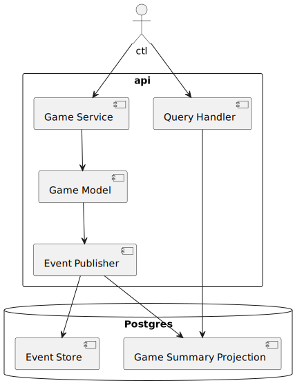

# Deep Strike

> Monorepo for **Deep Strike**, a Battleship-inspired game for **2 players**

> ⚠️ **Note**: This project is a **Proof of Concept (PoC)** created to practice concepts such as **Domain-Driven Design (DDD)**, **Clean Architecture**, **Event Sourcing**, and related software architecture patterns.  
> It is not intended for production use.
---

## 📑 Table of Contents

1. [Project Structure](#-project-structure)
2. [About the Game](#-about-the-game)
3. [Architecture](#-architecture)
    - [API](#api--domain-core)
    - [CTL](#ctl--supporting-domain)
4. [DeepStrike API](#-deepstrike-api)
5. [Database](#-database)
6. [CLI Client (`ctl`)](#-cli-client-ctl)
7. [Getting Started](#-getting-started)

## 🗂️ Project Structure

This project is organized as a **multi-module Maven build**:

- **`api/`** → REST API exposing the game endpoints
- **`spec/`** → OpenAPI specification (used to generate server and client stubs)
- **`ctl/`** → Command-line client (Shell) to interact with the API

---

## 🎮 About the Game

The game is played on four grids, two for each player. The grids are typically square, usually 10×10, and the individual squares in the grid are identified by letter and number. On one grid the player arranges ships and records the shots by the opponent. On the other grid, the player records their own shots.

Before play begins, each player secretly arranges their ships on their primary grid. Each ship occupies a number of consecutive squares on the grid, arranged either horizontally or vertically. The number of squares for each ship is determined by the type of ship. The ships cannot overlap (i.e., only one ship can occupy any given square in the grid) or be placed diagonally. The types and numbers of ships allowed are the same for each player. These may vary depending on the rules. The ships should be hidden from the opposing player's sight and players are not allowed to see each other's pieces. The game is a discovery game in which players need to discover their opponent's ship positions.

The rules specify the following ships:

| No. | Class of ship | Size |
| --- | --- | --- |
| 1 | Carrier | 5 |
| 2 | Battleship | 4 |
| 3 | Destroyer | 3 |
| 4 | Submarine | 3 |
| 5 | Patrol Boat | 2 |

After the ships have been positioned, the game proceeds in a series of rounds. In each round, each player takes a turn to announce a target square in the opponent's grid which is to be shot at. The opponent announces whether or not the square is occupied by a ship. If it is a "hit", the player who is hit marks this on their own "ocean" or grid (with a red peg in the pegboard version), and announces what ship was hit. The attacking player marks the hit or miss on their own "tracking" or "target" grid with a pencil marking in the paper version of the game, or the appropriate color peg in the pegboard version (red for "hit", white for "miss"), in order to build up a picture of the opponent's fleet.

When all of the squares of a ship have been hit, the ship's owner announces the sinking of the Carrier, Submarine, Cruiser/Destroyer/Patrol Boat, or the titular Battleship. If all of a player's ships have been sunk, the game is over and their opponent wins.

For more, check [Wikipedia](https://en.wikipedia.org/wiki/Battleship_(game))

---

## 🏗️ Architecture

The project is split into two main modules with different architectural approaches:

### **API – Domain Core**

The **`api/`** project implements the main domain logic of the game.  
It follows **DDD (Domain-Driven Design)** principles, combined with **Event Sourcing**, **CQRS**, and **Clean Architecture**.

- **DDD** → The game logic (entities, aggregates, value objects, services) is modeled around the **ubiquitous language** of Battleship.
- **Event Sourcing** → Instead of persisting only the current state, all events (shots fired, fleet placed, player joined, etc.) are stored in an event store.
    - This allows **navigating the full history of the game** from the beginning to the end, and even reconstructing the state at any past moment.
- **CQRS** → Commands update the state by appending new events to the event store. Queries are answered by **read projections**, such as the `game_summary` table, which is updated asynchronously from events.
    - This provides **fast queries** without reconstructing the aggregate.
    - The domain model for writes remains clean and focused on business logic.
- **Clean Architecture** → Clear separation between domain, application, and infrastructure layers.
- **OpenAPI** → Contract-first development. API specification is defined in the `spec/` module and server stubs are generated with **openapi-generator-maven-plugin**.
- **PostgreSQL + Liquibase** → Event store and read models persisted in Postgres, schema evolution managed with Liquibase.
- **Docker** → Infra runs easily with containers (Postgres).

### **CTL – Supporting Domain**

The **`ctl/`** project is a **transaction script** style application.  
It is not domain-heavy — its goal is just to **consume the API** and provide a CLI interface to the user.

- Built with **Spring Shell**, mapping commands like `create`, `fire`, `join` to API calls.
- Implements **error handling and colored outputs** for a better UX.
- Lightweight architecture: just orchestrates requests/responses with minimal business logic.


## 🔗 Communication Flow


(from https://www.planttext.com/)

---

## 🎮 DeepStrike API

The API specification is defined using **OpenAPI 3.0**.

We use the **[openapi-generator-maven-plugin](https://openapi-generator.tech/docs/plugins/#maven)** to generate Java classes for the API models and interfaces directly from the specification, ensuring consistency between the contract and the implementation.

API available at: 👉 http://localhost:8080

Base URL: 👉 `http://localhost:8080/api`

Swagger available at: 👉 http://localhost:8080/swagger-ui/index.html

### 🕹️ Endpoints

1. Create a new game

`POST /games`

Create a new game informing the hosted player.

**Request Body:**
```json
{
  "hostPlayerId": "player-id-username"
}
```

Note: `player-id-username` is the username(string) of the player that will host the game.

**Response:**

* 201 Created → [GameCreatedResponse](spec/src/main/resources/openapi.yaml)

2. List games

`GET /games?playerId={playerId}`

Lists all games, filtering by player.

**Query params:**

* playerId – returns only games where the player participates.

**Response:**

* 200 OK → [GameSummaryResponse[]](spec/src/main/resources/openapi.yaml)

3. Get game details

`GET /games/{gameId}?version={version}`

Returns the game by id.

**Path params:**

* gameId (uuid) – game identifier

**Query params:**

* version (optional) – specific version of the aggregate

**Response:**

* 200 OK → [GameDetailResponse](spec/src/main/resources/openapi.yaml)

4. Join in a game

`POST /games/{gameId}/join`

A player enters an open game.

**Path params:**

* gameId (uuid) – game identifier

**Request Body:**
```json
{
  "playerId": "player-id-username"
}
```
Note: `player-id-username` is the username(string) of the player (it needs to be different from the host player).

**Response:**

* 204 No Content

5. Place fleet

`POST /games/{gameId}/fleet`

The player positions his fleet on the board.

**Path params:**

* gameId (uuid) – game identifier

**Request Body:**
```json
{
  "playerId": "player-id-username",
  "ships": [
    {
      "type": "DESTROYER",
      "bow": { "x": 1, "y": 2 },
      "orientation": "HORIZONTAL"
    }
  ]
}
```
Note: ships property is optional. If not provided, the player will be asked to place the fleet randomly.

**Response:**

* 200 OK  → [FleetDeploymentResponse](spec/src/main/resources/openapi.yaml)

6. Mark as ready

`POST /games/{gameId}/ready`

The player indicates that he has finished positioning the fleet.

**Path params:**

* gameId (uuid) – game identifier

**Request Body:**
```json
{
  "playerId": "player-id-username"
}
```

**Response:**

* 204 No Content

7. Shoot at the opponent

`POST /games/{gameId}/shots`

The player whose turn it is fires at an opponent's coordinate.

**Path params:**

* gameId (uuid) – game identifier

**Request Body:**
```json
{
  "playerId": "player-id-username",
  "target": { "x": 3, "y": 4 }
}
```

**Response:**

* 200 OK  → [ShotResultResponse](spec/src/main/resources/openapi.yaml)


⚠️ All endpoints can return errors in the format:

```json
{
  "code": 400,
  "message": "Error message"
}
```

---

## 🗄️ Database

The project uses `PostgreSQL` as the database, running via Docker.
Configuration is defined in the [compose.yaml](api/compose.yaml) file.

Database containers are automatically managed by `Spring Boot Docker Compose Support`, so you don’t need to run docker compose up manually.
When the application starts, Spring will ensure the Postgres container is up and running.

Schema versioning is managed with `Liquibase`, ensuring controlled and reproducible database evolution.

### 📑 Database schema

#### **1. event_store**
Stores the events for Event Sourcing.

| Column       | Type         | Constraints                                      |
|--------------|--------------|--------------------------------------------------|
| id           | BIGSERIAL    | PK, auto increment                               |
| aggregate_id | UUID         | NOT NULL                                         |
| version      | INT          | NOT NULL                                         |
| event_type   | VARCHAR(255) | NOT NULL                                         |
| payload      | JSONB        | NOT NULL                                         |
| occurred_at  | TIMESTAMP    | NOT NULL                                         |

**Constraints and indexes:**
- `uq_event_store_aggregate_version` → unique `(aggregate_id, version)`
- `idx_event_store_aggregate_id` → index on `aggregate_id`

#### **2. game_summary**
Read model table for fast queries about the state of each game.

| Column       | Type         | Constraints                      |
|--------------|--------------|----------------------------------|
| id           | UUID         | PK                               |
| version      | INT          | NOT NULL                         |
| status       | VARCHAR(20)  | NOT NULL                         |
| player1      | VARCHAR(255) | NOT NULL                         |
| player2      | VARCHAR(255) | NULL                             |
| current_turn | VARCHAR(255) | NULL                             |
| winner       | VARCHAR(255) | NULL                             |
| created_at   | TIMESTAMP    | NOT NULL                         |
| updated_at   | TIMESTAMP    | NOT NULL                         |

**Constraints:**
- `uq_game_summary_id_version` → unique `(id, version)`

---

## 🕹️ CLI Client (`ctl`)

The **ctl** module provides an interactive command-line interface for playing the game.  
It is powered by **Spring Shell**, which maps commands to the API endpoints, so players can create, join, and play games directly from the terminal.

### Available Commands

### Available Commands

- `context` → Show current context (base URL, player ID)
- `create` → Create a new game
- `detail <gameId> [version]` → Show details of a game by ID.  
  If `version` is provided, shows the game state at that version (navigating through the event history).  
  Clears the screen before rendering the board.
- `list` → List available games for the current player
- `join <gameId>` → Join an existing game
- `ready <gameId>` → Mark the current player as ready
- `fire <gameId> <x> <y>` → Fire at a coordinate in the given game
- `place-fleet-random <gameId>` → Place the fleet randomly
- `place-fleet <gameId> <fleetFilePath>` → Place the fleet from a JSON file

Error handling is included — any API errors will be displayed in red in the terminal.


Exemples:

* Player creates a game
```shell
[deepstrike:>create
Game had created with ID: 4791b6c6-8b4c-4b73-99d9-b402156100f6
```

* Player(opponent) joins a game

```shell
[deepstrike:>join 4791b6c6-8b4c-4b73-99d9-b402156100f6
You joined the game 4791b6c6-8b4c-4b73-99d9-b402156100f6
```

* Player places the fleet

```shell
[deepstrike:>place-fleet 4791b6c6-8b4c-4b73-99d9-b402156100f6
Board
   A B C D E F G H I J 
 0 ~ ~ ~ ~ ~ ~ ~ ~ ~ ~ 
 1 ~ ~ ~ ~ ~ ~ ~ ~ ~ ~ 
 2 ~ █ ~ ~ ~ ~ ~ ~ ~ ~ 
 3 ~ █ ~ ~ ~ ~ ~ █ █ █ 
 4 ~ █ ~ █ █ █ █ ~ ~ ~ 
 5 ~ █ ~ ~ ~ ~ ~ █ █ █ 
 6 ~ █ ~ ~ ~ ~ ~ ~ ~ ~ 
 7 ~ ~ ~ ~ ~ ~ ~ ~ ~ ~ 
 8 █ ~ ~ ~ ~ ~ ~ ~ ~ ~ 
 9 █ ~ ~ ~ ~ ~ ~ ~ ~ ~ 

Fleet placed (5 ships)!
```
* Get details of the game

```shell
[deepstrike:>detail 4791b6c6-8b4c-4b73-99d9-b402156100f6
Game 4791b6c6-8b4c-4b73-99d9-b402156100f6 | Status: Setup
Created At: 2025-09-10T13:55:53.016564Z
Thiago vs. Pedro
Turn: - | Winner: -

Thiago's Board               Pedro's Board
   A B C D E F G H I J       A B C D E F G H I J 
0  ~ ~ ~ ~ ~ ~ ~ ~ ~ ~    0  ~ ~ ~ ~ ~ ~ ~ ~ ~ ~ 
1  ~ ~ ~ ~ ~ ~ ~ ~ ~ ~    1  ~ ~ ~ ~ ~ ~ ~ ~ ~ ~ 
2  ~ █ ~ ~ ~ ~ ~ ~ ~ ~    2  ~ ~ ~ ~ ~ ~ ~ ~ ~ ~ 
3  ~ █ ~ ~ ~ ~ ~ █ █ █    3  ~ ~ ~ ~ ~ ~ ~ ~ ~ ~ 
4  ~ █ ~ █ █ █ █ ~ ~ ~    4  ~ ~ ~ ~ ~ ~ ~ ~ ~ ~ 
5  ~ █ ~ ~ ~ ~ ~ █ █ █    5  ~ ~ ~ ~ ~ ~ ~ ~ ~ ~ 
6  ~ █ ~ ~ ~ ~ ~ ~ ~ ~    6  ~ ~ ~ ~ ~ ~ ~ ~ ~ ~ 
7  ~ ~ ~ ~ ~ ~ ~ ~ ~ ~    7  ~ ~ ~ ~ ~ ~ ~ ~ ~ ~ 
8  █ ~ ~ ~ ~ ~ ~ ~ ~ ~    8  ~ ~ ~ ~ ~ ~ ~ ~ ~ ~ 
9  █ ~ ~ ~ ~ ~ ~ ~ ~ ~    9  ~ ~ ~ ~ ~ ~ ~ ~ ~ ~ 

>>Pedro placed fleet for game
```
Note: note that the opponent's board is not rendered.

* Player marks the game as ready

```shell
[deepstrike:>ready 4791b6c6-8b4c-4b73-99d9-b402156100f6
You are ready!
```

* Player fires at the opponent

```shell
[deepstrike:>fire 4791b6c6-8b4c-4b73-99d9-b402156100f6 0 0
Game a9215bdd-ab1d-4292-92a8-a4661a857bc9 | Status: In Progress
Created At: 2025-09-10T13:55:53.016564Z
Thiago vs. Pedro
Turn: Pedro | Winner: -

Thiago's Board               Pedro's Board
   A B C D E F G H I J       A B C D E F G H I J 
0  ~ ~ ~ ~ ~ ~ ~ ~ ~ ~    0  o ~ ~ ~ ~ ~ ~ ~ ~ ~ 
1  ~ ~ ~ ~ ~ ~ ~ ~ ~ ~    1  ~ ~ ~ ~ ~ ~ ~ ~ ~ ~ 
2  ~ █ ~ ~ ~ ~ ~ ~ ~ ~    2  ~ ~ ~ ~ ~ ~ ~ ~ ~ ~ 
3  ~ █ ~ ~ ~ ~ ~ █ █ █    3  ~ ~ ~ ~ ~ ~ ~ ~ ~ ~ 
4  ~ █ ~ █ █ █ █ ~ ~ ~    4  ~ ~ ~ ~ ~ ~ ~ ~ ~ ~ 
5  ~ █ ~ ~ ~ ~ ~ █ █ █    5  ~ ~ ~ ~ ~ ~ ~ ~ ~ ~ 
6  ~ █ ~ ~ ~ ~ ~ ~ ~ ~    6  ~ ~ ~ ~ ~ ~ ~ ~ ~ ~ 
7  ~ ~ ~ ~ ~ ~ ~ ~ ~ ~    7  ~ ~ ~ ~ ~ ~ ~ ~ ~ ~ 
8  █ ~ ~ ~ ~ ~ ~ ~ ~ ~    8  ~ ~ ~ ~ ~ ~ ~ ~ ~ ~ 
9  █ ~ ~ ~ ~ ~ ~ ~ ~ ~    9  ~ ~ ~ ~ ~ ~ ~ ~ ~ ~ 

>>Pedro started turn

Shot fired at (0,0) with result: MISS
```

---

## 🚀 Getting Started

### Prerequisites
- [Java 21+](https://www.oracle.com/java/technologies/javase/jdk21-archive-downloads.html)
- [Docker](https://www.docker.com/)
- [Maven](https://maven.apache.org/) (or use the included Maven Wrapper `./mvnw`)

### Build All Modules

```bash
./mvnw clean install
```

### Run API Server

```bash
cd api/
../mvnw spring-boot:run
```

### Run Client (Shell)

```bash
cd ctl/
../mvnw spring-boot:run -Dspring-boot.run.jvmArguments="-Dapp.context.player-id=${HERE_PUT_YOUR_USERNAME}"
```